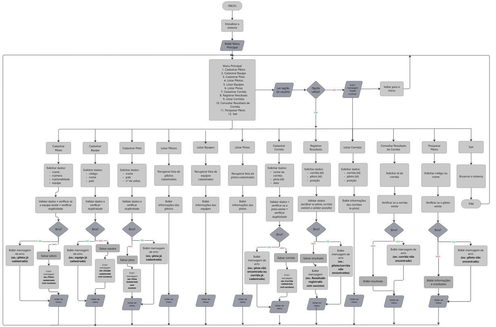

# Título do Projeto: RacingGestor — Sistema de Gerenciamento de Campeonato de Fórmula 1

## 1. Descrição do Sistema

O **RacingGestor** é um sistema desenvolvido em linguagem C para auxiliar no gerenciamento de campeonatos de Fórmula 1. O problema que ele busca resolver é a dificuldade de manter, de forma centralizada e organizada, as informações de pilotos, equipes, pistas, corridas e resultados. Quando esses dados são controlados manualmente ou ficam distribuídos, podem ocorrer duplicidades, perda de informações e dificuldades para localizar os resultados e acompanhar a pontuação do campeonato.

Para solucionar esse problema, o sistema permite cadastrar e consultar pilotos, equipes, pistas e corridas, mantendo o relacionamento entre esses registros. Também é possível registrar o resultado de cada corrida, associando-a à pista utilizada e armazenando a posição obtida por cada piloto. A partir dessas posições, os pontos correspondentes são calculados e atribuídos aos pilotos e às equipes, facilitando o acompanhamento da classificação.

Dessa forma, o **RacingGestor** oferece uma solução simples e estruturada para organizar os dados do campeonato, reduzir inconsistências nos cadastros e tornar mais ágil a consulta das informações e dos resultados das corridas.

## 2. Fluxo de Utilização Esperado para o Sistema

Ao iniciar o *RacingGestor*, o usuário terá acesso ao menu principal, que apresentará as seguintes opções:

1. *Cadastrar Piloto*
2. *Cadastrar Equipe*
3. *Cadastrar Pista*
4. *Listar Pilotos*
5. *Listar Equipes*
6. *Listar Pistas*
7. *Cadastrar Corrida*
8. *Registrar Resultado*
9. *Listar Corridas*
10. *Consultar Resultado de Corrida*
11. *Pesquisar Piloto*
12. *Sair*

### Funcionamento das opções

- Caso o usuário selecione *1*, o programa solicitará as informações necessárias para registrar um novo piloto, como nome, número, nacionalidade e equipe. Depois do cadastro, os dados ficarão armazenados para serem utilizados durante o campeonato.
- Caso o usuário selecione *2*, o sistema solicitará as informações referentes à equipe, como código, nome e país, efetuando o registro da equipe participante.
- Caso o usuário selecione *3*, serão solicitados os dados da pista, incluindo nome, país e número de voltas, permitindo que ela seja adicionada ao sistema.
- Caso o usuário selecione *4*, o programa exibirá todos os pilotos registrados, apresentando suas principais informações.
- Caso o usuário selecione *5*, o sistema mostrará a relação completa das equipes cadastradas.
- Caso o usuário selecione *6*, o sistema exibirá todas as pistas registradas, juntamente com suas principais informações.
- Caso o usuário selecione *7*, será possível registrar uma nova corrida, informando seu nome, a pista onde acontecerá e a respectiva data.
- Caso o usuário selecione *8*, o sistema solicitará a corrida e a colocação obtida por cada piloto participante. A partir das posições informadas, os pontos correspondentes serão calculados e adicionados aos respectivos pilotos e equipes.
- Caso o usuário selecione *9*, o programa apresentará todas as corridas registradas, mostrando suas informações e as respectivas pistas onde serão realizadas.
- Caso o usuário selecione *10*, será possível consultar uma corrida específica, exibindo a pista utilizada e os resultados obtidos pelos pilotos.
- Caso o usuário selecione *11*, o sistema permitirá localizar um piloto por meio de seu código ou nome, apresentando seus dados cadastrais e os resultados obtidos nas corridas.
- Caso o usuário selecione *12*, o programa encerrará sua execução.

### Tratamento de Erros

As ações que apresentarem algum problema, como piloto inexistente, equipe não registrada, corrida não cadastrada ou tentativa de realizar um cadastro duplicado, deverão apresentar mensagens objetivas ao usuário. Quando for inserido um código ou registro que não esteja presente no sistema, será informado que o cadastro solicitado não foi localizado. Depois da conclusão de cada operação, o usuário poderá voltar ao menu principal e selecionar uma nova funcionalidade.

## 3. Fluxograma da Lógica do Sistema


## 4. Estrutura de Dados

O **RacingGestor** utilizará as seguintes estruturas heterogêneas (structs) para organizar e armazenar os dados de pilotos, equipes, pistas, corridas e resultados do campeonato.

```c
// Estrutura para armazenamento dos Pilotos
typedef struct {
    int id_piloto;
    char nome[100];
    int numero;
    char nacionalidade[50];
    int id_equipe;
    int pontos;
} Piloto;

// Estrutura para armazenamento das Equipes
typedef struct {
    int id_equipe;
    char nome[100];
    char pais[50];
    int pontos;
} Equipe;

// Estrutura para armazenamento das Pistas
typedef struct {
    int id_pista;
    char nome[100];
    char pais[50];
    int numero_voltas;
} Pista;

// Estrutura para armazenamento das Corridas
typedef struct {
    int id_corrida;
    char nome[100];
    int id_pista;
    char data[11];
} Corrida;

// Estrutura para armazenamento dos Resultados
typedef struct {
    int id_resultado;
    int id_corrida;
    int id_piloto;
    int posicao;
    int pontos;
} Resultado;
```
